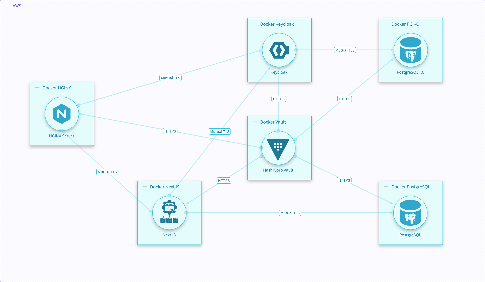

# Pay n' Go Next - Identity Management and Access Control System

A secure three-tier web application implementing OAuth 2.0 authentication, role-based access control (RBAC), and centralized secrets management.

## Overview

Pay n' Go Next is a modernized toll payment application that demonstrates enterprise-grade security patterns across all system layers. The architecture combines identity management (Keycloak), secure data storage (PostgreSQL), secrets management (HashiCorp Vault), application logic (Next.js), and network security (NGINX) to establish a robust, zero-trust infrastructure.

The system implements mutual TLS authentication across all inter-service communications and uses AppRole-based secrets injection via Vault agents to ensure credentials never persist in plaintext configuration files.

## Architecture



## Core Components

### 1. NGINX Reverse Proxy

**Role**: Entry point and TLS termination for the frontend

**Security features**:
- Terminates all HTTPS connections (port 443)
- Routes traffic to internal services over mutual TLS
- Enforces security headers and CSP policies
- Protects against slowloris and other DoS attacks

**Configuration**: Container-based with mounted certificates

### 2. Next.js Application (PNGN)

**Technology Stack**:
- Framework: Next.js
- Authentication: NextAuth.js (OpenID Connect client)

**Key Features**:

#### Authentication & Authorization
- OAuth 2.0 / OpenID Connect (OIDC) integration with Keycloak
- Middleware-enforced session validation
- JWT-based token handling with signature verification via JWKS
- Role-based access control (RBAC) through Keycloak groups

#### Security Implementation
- Server-side session management (no sensitive data exposed to client)
- Content Security Policy (CSP) with nonce-based inline script allowlisting
- Rate limiting: 100 requests/minute per IP address
- Input validation and parameterized queries
- TLS client certificates for database and Keycloak communication
- Automatic HTTP-to-HTTPS upgrade enforcement

**Network Access**:
- Outbound connections to Keycloak (mutual TLS)
- Outbound connections to PostgreSQL (mutual TLS)
- Inbound from NGINX reverse proxy only

**Certificate Management**:
- Application certificates provisioned by Vault agents
- Automatic certificate rotation via Vault
- Certificates mounted as read-only secrets at runtime

### 3. Keycloak Identity Provider

**Role**: Centralized authentication and authorization server

**Configuration**:
- Realm: Dedicated to Pay n' Go Next application
- Client Authentication: Client ID + Client Secret (confidential client)
- Authorization Flow: Standard OAuth 2.0 Authorization Code Flow only
- Token Verification: JWKS (JSON Web Key Set) endpoint

**Security Policies**:

| Policy | Setting | Details |
| --- | --- | --- |
| Password Minimum Length | 8 characters | Enforced minimum complexity |
| Password Uppercase | Required | At least one uppercase letter (A-Z) |
| Password Lowercase | Required | At least one lowercase letter (a-z) |
| Password Numbers | Required | At least one digit (0-9) |
| Password Special Characters | Required | At least one special character |
| Password History | 3 previous | Cannot reuse last 3 passwords |
| Password Expiration | 365 days | Annual password rotation |
| Account Lockout (Temporary) | 30 failed attempts | Temporary lockdown triggered |
| Account Lockout (Permanent) | After temporary | Requires admin intervention to unlock |
| Session Idle Timeout | 30 minutes | Automatic logout on inactivity |
| Session Maximum Duration | 10 hours | Hard limit on active sessions |

**User Roles**:
1. **Registered User** - Default role for all authenticated users
   - View/edit personal profile and payment methods
   - Manage vehicles and devices
   - View trip history

2. **Administrator** - Elevated privileges (manually assigned)
   - All Registered User permissions
   - Manage toll booths
   - System configuration

3. **Account Manager** - Identity system administration
   - Manage user accounts and assignments
   - Configure Keycloak realm and client settings
   - Monitor login activity and sessions

**Database**: PostgreSQL with dedicated Keycloak-specific instance (`postgres-kc`)

**Network Access**:
- TLS-secured connections only
- Mutual authentication with NextJS and Vault

### 4. PostgreSQL

**Role**: Persistent data storage for application

**Database Objects**:
- User profiles and authentication metadata
- Vehicle information and device associations
- Trip records and toll booth transactions
- Payment method data

**Security Configuration**:
- Dedicated non-admin database user for application
- Row-level security (RLS) policies by user ID
- TLS-only connections (mutual TLS with application)
- Certificate-based authentication for administrative access
- Connection timeout limits

**Certificate Management**:
- Certificates provisioned by Vault agents
- Rotated automatically by Vault
- Mounted as read-only secrets

### 5. PostgreSQL (Keycloak Database)

**Role**: Persistent storage for authentication system state

**Contents**:
- User accounts and credentials
- Session tokens and refresh tokens
- Realm configurations and client settings
- Role mappings and group memberships

**Security**:
- Isolated from main application database
- TLS connections only
- Administrative password managed by Vault

### 6. HashiCorp Vault (Central Secrets Management)

**Role**: Cryptographic storage and automatic secret rotation

**Capabilities Enabled**:
- **PKI Engine**: Public Key Infrastructure with centralized certificate authority
  - Imported existing CA certificate and private key
  - Issues short-lived certificates (TTL: 30 days, Max TTL: 60 days)
  - Supports Server Authentication and Client Authentication extensions
  - RSA 2048-bit key strength

- **AppRole Engine**: Machine-to-machine authentication
  - Role IDs and Secret IDs for service authentication
  - Used by Vault agents for automatic token acquisition

**Initialization**:
- Shamir's Secret Sharing with 5 keys, 3-key threshold
- No single person has complete control
- Requires periodic unsealing with 3 out of 5 keys

**Vault Agents**:
- Deployed alongside each service requiring certificates
- Automatic authentication via AppRole
- Template rendering for certificate injection
- Periodic certificate renewal and rotation

**Network**: Exposed only internally to services; inaccessible from external networks

## Data Flow and Security

### User Authentication Flow

```
1. User accesses https://pngn.example.com
   └─▶ NGINX (TLS termination)
       └─▶ NextJS (CSP enforcement, rate limiting)
           └─▶ [GET] /api/auth/signin
               └─▶ Keycloak (OAuth authorization endpoint)
                   └─▶ User authenticates and consents
                       └─▶ Authorization code issued
                           └─▶ NextJS exchanges code for tokens (mutual TLS)
                               └─▶ JWT tokens validated via JWKS
                                   └─▶ Session established (server-side only)
                                       └─▶ Redirect to authenticated page
```

### Application Data Access

```
Authenticated User Request:
┌─────────────────────────────────────┐
│ Browser (Client)                    │
└────────┬────────────────────────────┘
         │ HTTPS + Session Cookie
         ▼
┌─────────────────────────────────────┐
│ NGINX Reverse Proxy                 │
│ ├─ TLS Termination                  │
│ └─ Security Headers                 │
└────────┬────────────────────────────┘
         │ Mutual TLS + Client Certificate
         ▼
┌─────────────────────────────────────┐
│ Next.js Application                 │
│ ├─ Session Validation               │
│ ├─ Authorization Check              │
│ ├─ Rate Limiting                    │
│ └─ Input Validation                 │
└────────┬────────────────────────────┘
         │ Mutual TLS + Client Certificate
         ▼
┌─────────────────────────────────────┐
│ PostgreSQL Database                 │
│ ├─ TLS Connection                   │
│ ├─ User Authentication              │
│ └─ Row-Level Security               │
└─────────────────────────────────────┘
```

### Certificate Lifecycle

```
Vault → AppRole Authentication
  ↓
Vault Agent → Authenticates with AppRole (Role ID + Secret ID)
  ↓
Vault Agent → Receives token from Vault
  ↓
Vault Agent → Requests certificate from PKI engine
  ↓
Vault Agent → Monitors certificate expiration
  ↓
Vault Agent → Renders templates (substitutes variables)
  ↓
Vault Agent → Injects certificates into mounted volumes
  ↓
Service → Reads certificates (read-only filesystem)
  ↓
[Every 1h] Vault → Automatically rotates certificates
```

## Access Control Model

### RBAC Implementation

The application enforces role-based access control through Keycloak group membership:

**Keycloak Groups** (JWT Claims):
```json
{
  "groups": ["/Registered User"]  // or "/Administrator"
}
```

**Application Layer Enforcement**:
- Middleware checks JWT claims before route access
- Database row-level security filters data by user ID
- API endpoints validate user roles before returning resources

### Network Segmentation

| Network | Services | Traffic Type | Purpose |
| --- | --- | --- | --- |
| frontend | NGINX, NextJS | HTTPS + Mutual TLS | User-facing and internal app communication |
| backend | NextJS, PostgreSQL, Keycloak | Mutual TLS | Inter-service communication |
| vault | Vault, Vault Agents | Mutual TLS | Secrets management (isolated) |

## Development Environment (`Pay-n-Go-Next/`)

Contains the complete Next.js application source code. The project can be developed locally with `npm run dev` or built for production with `npm run build`. The Dockerfile packages the built application (`.next/standalone`) into a lightweight Node.js Alpine container, creating a standalone executable with minimal dependencies. Built images can be deployed directly or integrated into the production Docker Compose setup.

**Build Process**:
```bash
npm run build        # Compiles Next.js to .next/standalone
docker build -t pngn .  # Packages into container
```

## Production Environment (`Pay-n-Go-Next-Production/`)

Production environment is containerized using Docker:

- Docker Compose orchestration across multiple containers
- Vault integration with AppRole authentication
- Vault agents for certificate provisioning
- Mutual TLS between all services
- Persistent volumes for databases

**Key Production Features**:
- Multi-container deployment with network isolation
- Secrets management via HashiCorp Vault
- Automatic certificate rotation
- Persistent storage for databases
- Health checks and automatic restart policies

## Configuration Files

| File | Purpose | Location |
| --- | --- | --- |
| `docker-compose.yaml` | Service orchestration | `Pay-n-Go-Next-Production/` |
| `vault-agent-<service>.hcl` | Vault agent configuration | `Pay-n-Go-Next-Production/conf/` |
| `postgres.ctmpl` | Certificate template for DB | `Pay-n-Go-Next-Production/certs/templates/` |
| `middleware.ts` | Security headers & rate limiting | `Pay-n-Go-Next/` |
| `lib/auth.ts` | Keycloak integration | `Pay-n-Go-Next/` |

## Compliance and Standards

- **OAuth 2.0 / OpenID Connect**: Standard authentication protocol
- **NIST 800-53 Revision 5**: Access control and cryptography controls
